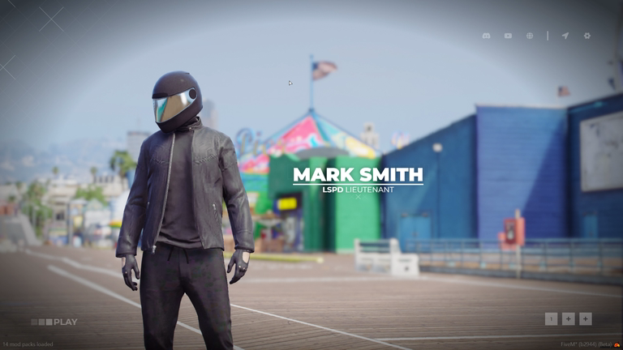
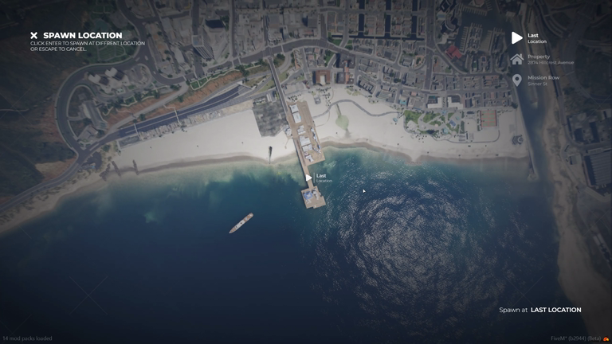
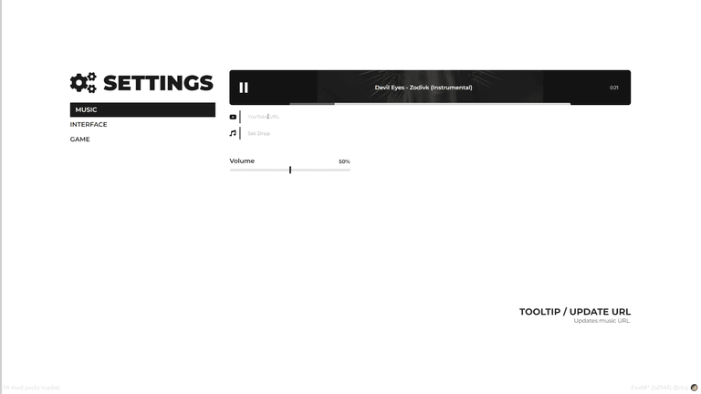
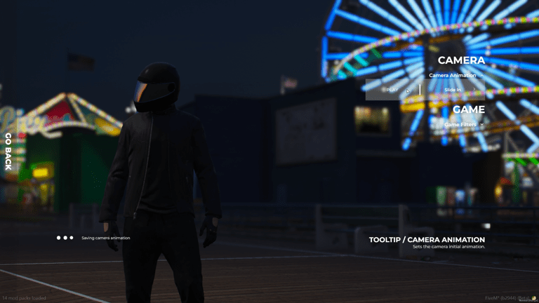
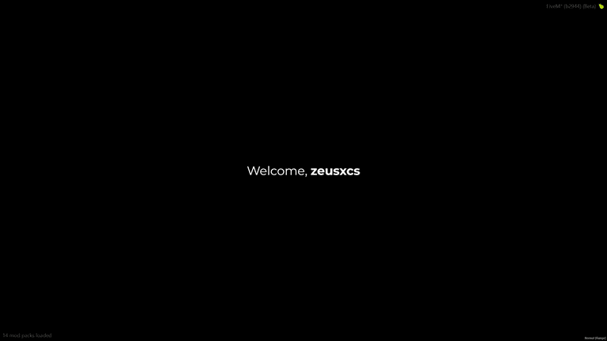
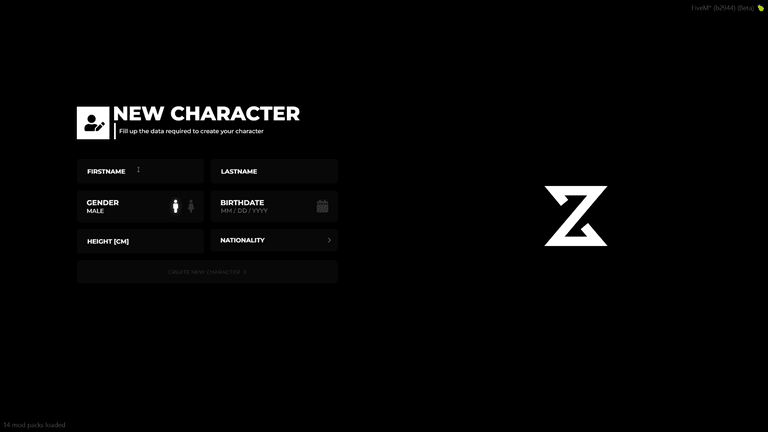
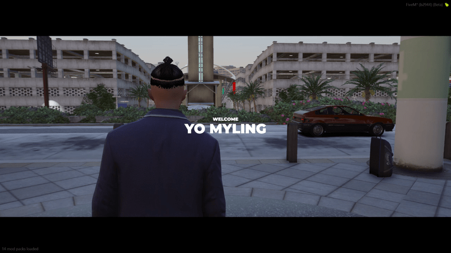

 <YouTubeGrid
	videos={[
		{
			href: 'https://www.youtube.com/watch?v=VjkWxeRo75w',
		},
	]}
/>

<CardGrid>
  <LinkCard title="Tebex Store" href="https://zsx-development.tebex.io/package/6101755">
  </LinkCard>
  <LinkCard title="CFX forum post"href="https://forum.cfx.re/t/qb-esx-zsx-multicharacter-cinematic-multicharacter/5205735">
  </LinkCard>
</CardGrid>

# Features

import { Card, CardGrid, LinkCard,} from '@astrojs/starlight/components';
import YouTubeGrid from '../../../components/youtube-grid.astro';

 <CardGrid>
  <Card title="Character Selection" icon="open-book">
    
  </Card>
  <Card title="Spawn Selection" icon="information">
     
  </Card>
   <Card title="Music Settings" icon="setting">
    
  </Card>
     <Card title="Camera Settings" icon="setting">
    
  </Card>
   <Card title="Light/Dark mode" icon="information">
   
  </Card>
   <Card title="Pre-register screen" icon="information">
    
  </Card>
    <Card title="Identity" icon="information">
    
  </Card>
    <Card title="After Character Creation" icon="information">
    
    </Card>
</CardGrid> 
