import { Card, CardGrid, LinkCard,} from '@astrojs/starlight/components';
import YouTubeGrid from '../../../../components/youtube-grid.astro';

<YouTubeGrid
	videos={[
		{
			href: 'https://youtu.be/wMEugRh8oE0',
		},
	]}
/>
<CardGrid>
  <LinkCard title="Sklep Tebex" icon="open-book" href="https://zsx-development.tebex.io/package/6088051">
  </LinkCard>
  <LinkCard title="Wpis na forum CFX" icon="information" href="https://forum.cfx.re/t/zsx-dealership-fivem-vehicle-shop-with-cinematic-camera-system/5167167">
  </LinkCard>
</CardGrid>

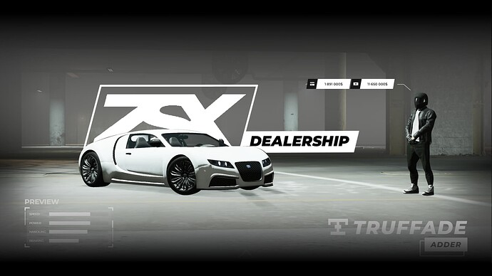

## Funkcje

<CardGrid>
  <Card title="Animowane dane gracza" icon="open-book">
    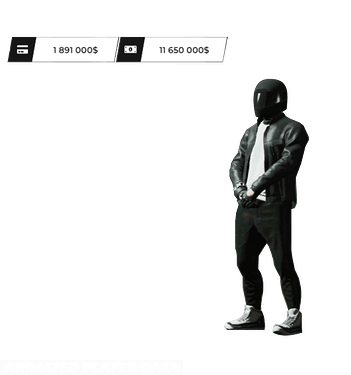
    UI przyczepi się do kości gracza.
  </Card>
  <Card title="Podgląd pojazdu" icon="information">
     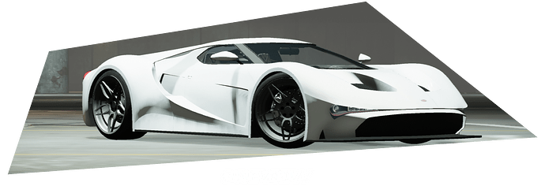
     Dealer ma wbudowaną funkcję obracania kamery wokół pojazdu. Sterowanie kamerą jest dość łatwe — wystarczy przesunąć kursor w pożądanym kierunku.
  </Card>
  <Card title="Wybór pojazdu" icon="setting">
    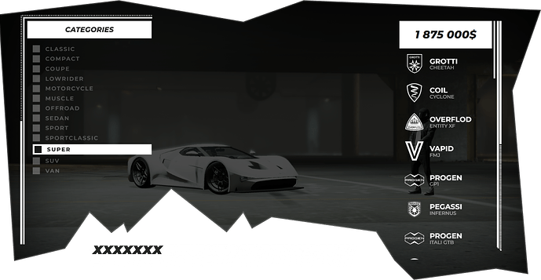
    Wybór pojazdu jest bardzo prosty w obsłudze. Dwa główne selektory są podzielone na kategorię i listę pojazdów. Ten interfejs korzysta z SVG, które są responsywne na każdej rozdzielczości i proporcji ekranu.
  </Card>
  <Card title="Kamera kinowa" icon="setting">
    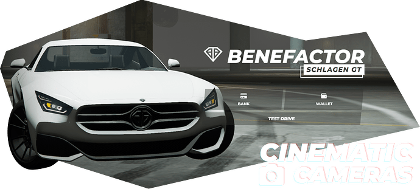
    Zapewnia nowy system kamery, który wykorzystuje krzywe cubicBezier do wygładzenia każdej sceny kinowej, czyniąc ją o wiele płynniejszą niż oryginalna.
  </Card>
  <Card title="Dostępność" icon="information">
    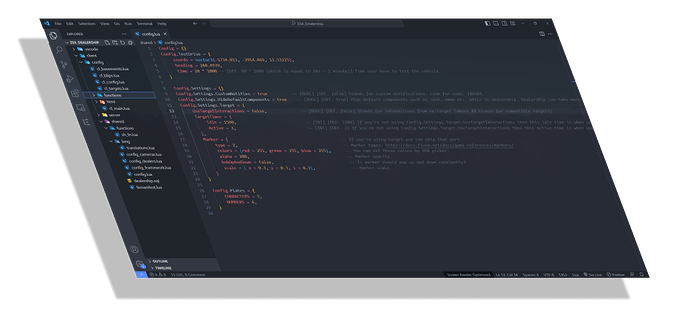
    Jak wielu moich klientów wie, lubię dawać możliwość dostosowania wszystkiego do swoich potrzeb. ZSX Dealership daje Ci tę możliwość, począwszy od domyślnej konfiguracji aż po ustawienia kamery.
  </Card>
  <Card title="System zapasów" icon="information">
    
    Dealer posiada wbudowany system zapasów, który pozwala ustawić liczbę pojazdów, które chcesz mieć w magazynie. System jest w pełni konfigurowalny i można go dostosować do własnych potrzeb.
  </Card>
  <Card title="Wiele salonów" icon="information">
    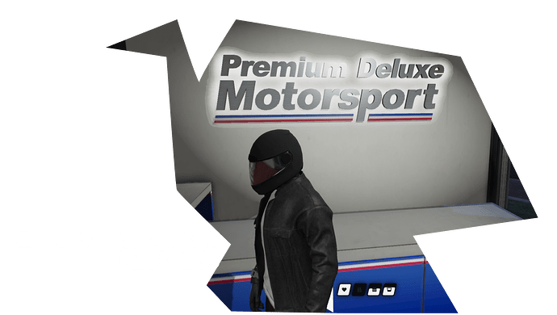
    Możesz stworzyć tyle sklepów z pojazdami, ile chcesz.
  </Card>
  <Card title="Ekskluzywna płatność" icon="information">
    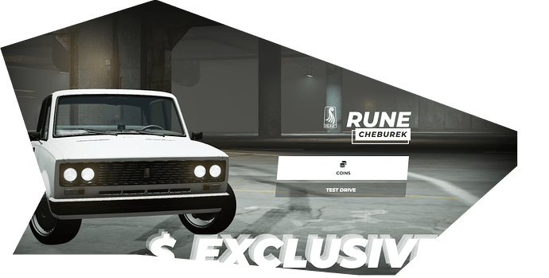
    Dealer ma wbudowany ekskluzywny system płatności, który pozwala używać innych walut do zakupu pojazdów, jeśli chcesz.
  </Card>

## Zrzuty ekranu z gry
---
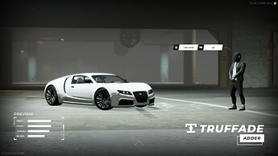

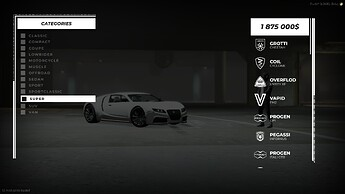

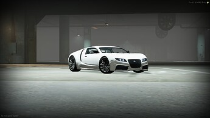

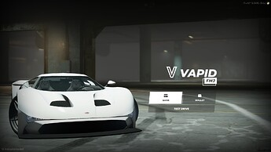

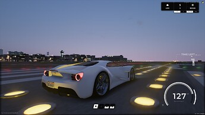

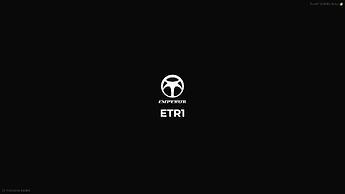
</CardGrid>
