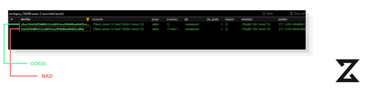
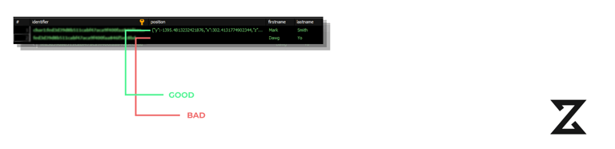

import { Code, Tabs, TabItem } from '@astrojs/starlight/components';

# Twój `es_extended Config.Multichar` nie jest włączony

Jeśli otrzymujesz ten błąd, oznacza to, że nie włączyłeś opcji `Config.Multichar` w pliku konfiguracyjnym `es_extended`. Aby to naprawić, przejdź do swojego pliku konfiguracyjnego `es_extended` i ustaw `Config.Multichar` na `true`.

```lua
Config.Multichar = true
```

Jeśli dołączyłeś do gry przed włączeniem `Config.Multichar`, wartość ta została ustawiona na `false`, co spowodowało, że ESX automatycznie stworzyło pusty wpis użytkownika z identyfikatorem, który nie pasuje do oczekiwanego wzorca (`char<id>:<identifier>`). Aby to naprawić, możesz usunąć niewłaściwie sformatowaną postać lub dodać `char1:` przed identyfikatorem.


## Nie udało się pobrać stanowiska z obiektu.

Ten błąd oznacza, że stanowisko gracza nie istnieje. Upewnij się, że Twoje stanowisko istnieje w tabelach `job` i `job_grades` w bazie danych.

## Nie udało się pobrać stopnia stanowiska z obiektu.

Ten błąd oznacza, że stopień stanowiska gracza nie istnieje. Upewnij się, że Twoje stanowisko istnieje w tabelach `job` i `job_grades` w bazie danych.

## Nie udało się pobrać pozycji gracza.

Jeśli z jakiegoś powodu Twój framework nie mógł ustawić pozycji, pojawi się ona jako null dla konkretnego gracza w bazie danych. Przejdź do swojej bazy danych, znajdź tabelę `users` i zmień kolumnę `position` dla określonego identyfikatora na przykład na:

```json
{"y":-2736.949462890625,"x":-1036.2989501953126,"heading":291.968505859375,"z":20.1640625}
```



# Baza danych

## Nieprawidłowa długość VARCHAR dla tabeli `zsx_multicharacter_slots`

Aby naprawić ten problem, wystarczy zmienić długość kolumny `identifier` w tabeli `zsx_multicharacter_slots` na 255. Możesz to zrobić, uruchamiając następujące zapytanie SQL:

```sql
ALTER TABLE `zsx_multicharacter_slots` MODIFY identifier VARCHAR(255);
```

## Nieprawidłowy typ identyfikatora dla wartości `Config.Characters.IdentifierType`

Jeśli otrzymujesz ten błąd, oznacza to, że ustawiłeś nieprawidłowy typ identyfikatora w opcji `Config.Characters.IdentifierType` w pliku `config.lua`. Prawidłowe typy identyfikatorów to `steam`, `license`, `license2` oraz `discord`. Aby to naprawić, przejdź do pliku `config.lua` i ustaw `Config.Characters.IdentifierType` na jeden z prawidłowych typów identyfikatorów.

Upewnij się, jaki typ identyfikatora używa Twój framework.

<Tabs>
  <TabItem label="ESX">
    <Code wrap code='-- DUMP Z pliku es_extended/server/functions.lua
function ESX.GetIdentifier(playerId)
    local fxDk = GetConvarInt("sv_fxdkMode", 0)
    if fxDk == 1 then
        return "ESX-DEBUG-LICENCE"
    end

    local identifier = GetPlayerIdentifierByType(playerId, "license") -- tutaj używasz typu identyfikatora
    return identifier and identifier:gsub("license:", "")
end' label = "es_extended/server/functions.lua" mark ="license" lang="lua" >

</Code>
  </TabItem>
  <TabItem label="QB">
    <Code wrap code="-- DUMP Z pliku qb-core/server/functions.lua
function QBCore.Functions.SetPlayerBucket(source, bucket)
    if source and bucket then
        local plicense = QBCore.Functions.GetIdentifier(source, 'license') -- tutaj używasz typu identyfikatora
        Player(source).state:set('instance', bucket, true)
        SetPlayerRoutingBucket(source, bucket)
        QBCore.Player_Buckets[plicense] = { id = source, bucket = bucket }
        return true
    else
        return false
    end
end" label = "qb-core/server/functions.lua" mark ="'license'" lang="lua" >

</Code>

  </TabItem>
</Tabs>