import { Aside, Tabs, TabItem, LinkCard, CardGrid } from '@astrojs/starlight/components';
import YouTubeGrid from '../../../../components/youtube-grid.astro';

<YouTubeGrid
	videos={[
		{
			href: 'https://www.youtube.com/watch?v=VjkWxeRo75w',
		},
	]}
/>

<CardGrid>
  <LinkCard title="Tebex Sklep" href="https://zsx-development.tebex.io/package/5289531">
  </LinkCard>
  <LinkCard title="Post na forum CFX" href="https://forum.cfx.re/t/qb-esx-standalone-hud-zsx-ui-user-friendly-interface-with-many-customization-options/4908261">
  </LinkCard>
</CardGrid>

## Czym jest ZSX-UI?

ZSX-UI to dostosowywalny zasób interfejsu użytkownika dla serwerów FiveM. Oferuje szeroki zakres funkcji i opcji dostosowywania, aby poprawić wrażenia użytkownika. Został zaprojektowany tak, aby był łatwy w użyciu i integracji z innymi zasobami.

Zawiera:

- Dostosowywalne ikony HUD
- Dostosowywalne powiadomienia
- Dostosowywalny pasek postępu
- Dostosowywalne wyświetlacze dla pracy / pieniędzy / banku / ID / liczby użytkowników online
- Dostosowywalny HUD pojazdu
- Menu w grze do edycji interfejsu dla każdego gracza

# Funkcje

## Dostosowywalne ikony HUD
<Tabs>
<TabItem label="Podstawowe">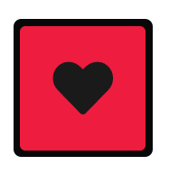</TabItem>

<TabItem label="Sześciokąt">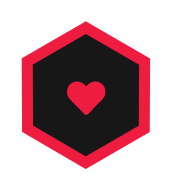</TabItem>

<TabItem label="SVG">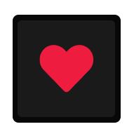</TabItem>

<TabItem label="Diament">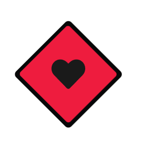</TabItem>

<TabItem label="Skośne">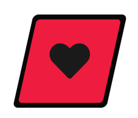</TabItem>

<TabItem label="Koło">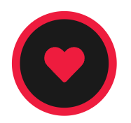</TabItem>

</Tabs>
<Tabs>
    <TabItem label="Procentowe Koło">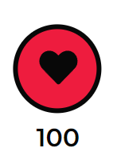</TabItem>
  
    <TabItem label="Prostokątny Pasek Postępu">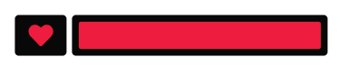</TabItem>
</Tabs>

## Dostosowywalne powiadomienia
<Tabs syncKey="hudv1">
    <TabItem label="Podstawowe">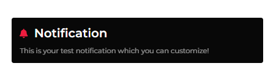</TabItem>
    
    <TabItem label="Klasyczne">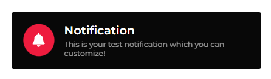</TabItem>
    
    <TabItem label="Nowoczesne">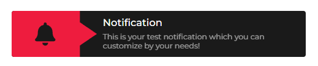</TabItem>
</Tabs>

## Dostosowywalny pasek postępu
<Tabs syncKey="hudv1">
    <TabItem label="Podstawowy"></TabItem>
    
    <TabItem label="Klasyczny"></TabItem>
  
    <TabItem label="Skośny">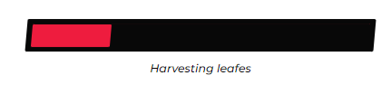</TabItem>
</Tabs>

## Dostosowywalne wyświetlacze dla pracy / pieniędzy / banku / ID / liczby użytkowników online

<Aside> Każdy z tych elementów można włączyć lub wyłączyć w pliku config.lua.</Aside>

<Tabs syncKey="hudv1">
    <TabItem label="Podstawowe"></TabItem>
   
    <TabItem label="Skośne">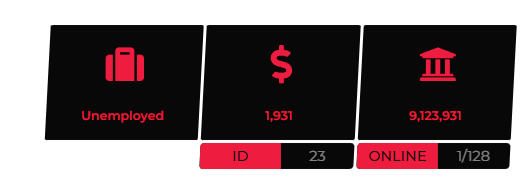</TabItem>
    
    <TabItem label="Nowoczesne">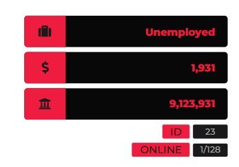</TabItem>
</Tabs>

## Dostosowywalny HUD pojazdu

<Tabs syncKey="hudv1">
    <TabItem label="Podstawowy">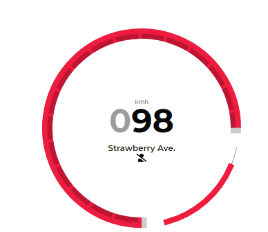</TabItem>
    
    <TabItem label="Zaawansowany">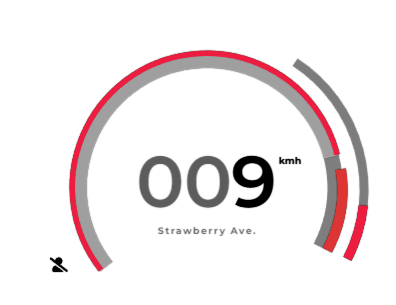</TabItem>
    
    <TabItem label="Nowoczesny"></TabItem>
</Tabs>

## Podgląd menu w grze do edycji interfejsu

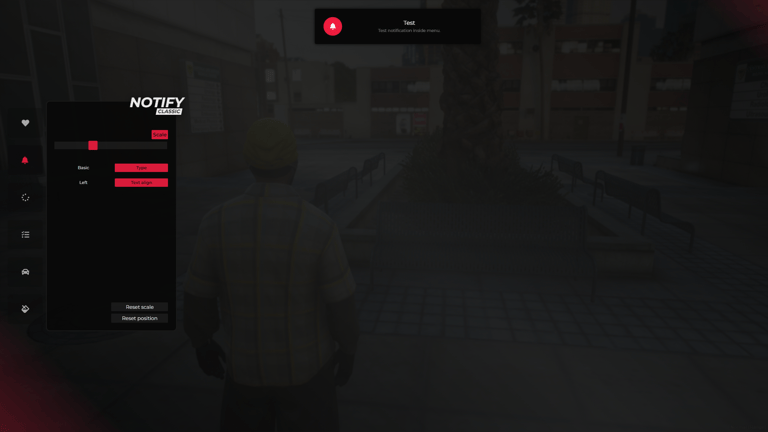

## Podgląd trybu edycji w grze

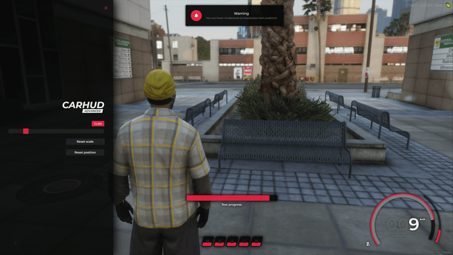
